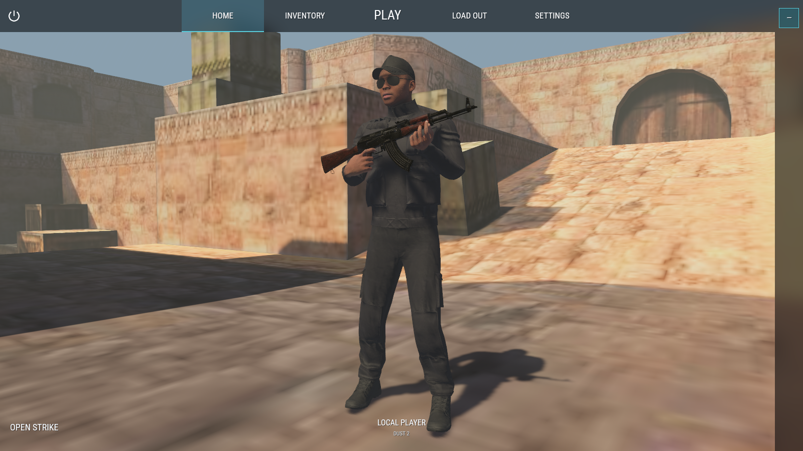
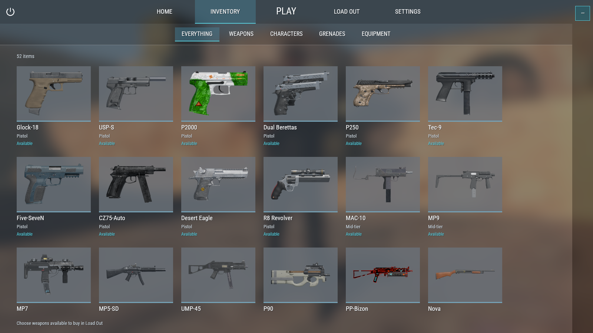
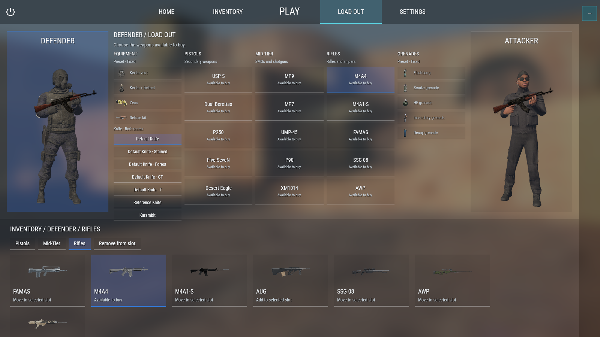
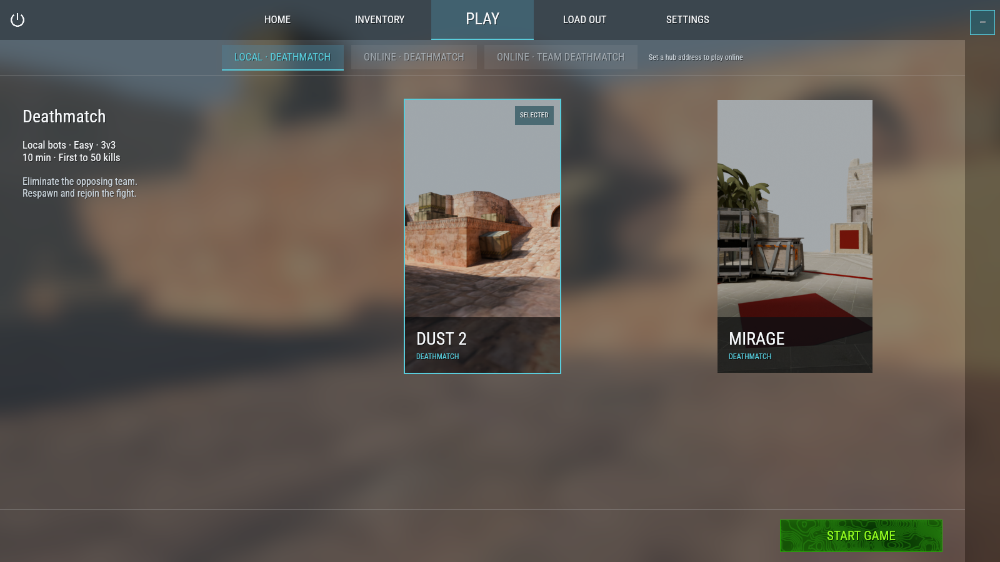
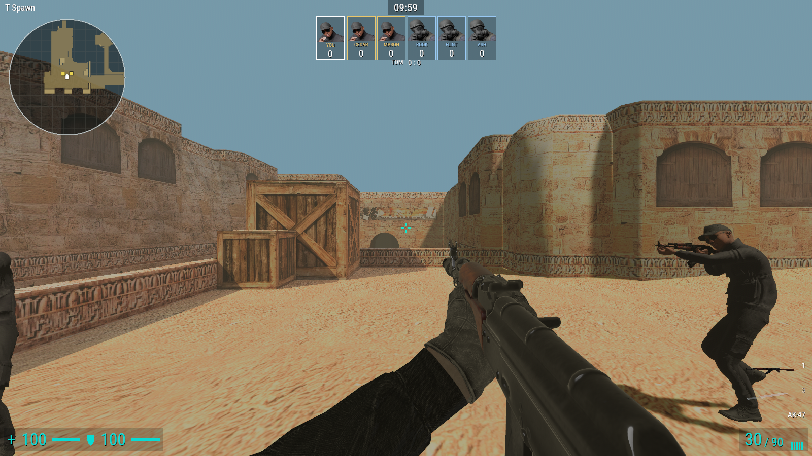

# Open Strike

An open-source tactical FPS inspired by Counter-Strike


## A look at the game

### Menu

Your starting point for matches, equipment, and your player profile.



### Inventory

Browse the weapons and equipment available for your arsenal.



### Loadout

Prepare your weapons and equipment for each side.



### Maps

Start on Dust 2 and Mirage, with crowdsourced CS:GO maps at the heart of the game's vision.



### Gameplay

Jump into team deathmatch: fight alongside your squad, rack up kills, and get back into the action after each respawn.



## Run and contribute

```sh
# Regular (generated audio; local catalog loads automatically if present)
cargo run --locked --bin open-strike

# Load local audio files
OPEN_STRIKE_AUDIO_PACK=assets/audio/local/catalog.ron cargo run --locked --bin open-strike
```

Use `OPEN_STRIKE_AUDIO_PACK=assets/audio/csgo/catalog.ron` for the private CS:GO pack.

### Local hub (online play and accounts)

`strike-hub` is the social server: accounts, friends, presence, and the match registry. There is no web dashboard; everything is in the client's sidebar.

```sh
# Hub + match server (restart either with `docker compose restart`)
docker compose up --build

# Client stays on the host — it needs a native GPU window
STRIKE_HUB_URL=http://127.0.0.1:7777 cargo run --locked --bin open-strike
```

`docker compose up` publishes the hub at `http://127.0.0.1:7777` and a Dust 2 team deathmatch on UDP `27015`. Account data lives in the `hub-data` volume. `docker compose restart` restarts both services; `docker compose down` stops them. Start only the hub with `docker compose up hub` if you just need accounts and friends.

The first account registered on an empty hub becomes its administrator. Login accepts username or email. To promote a later account:

```sh
docker compose exec hub ./strike-hub bootstrap-admin <username>
```

A second client with the same `STRIKE_HUB_URL` can search by username, send friend requests, and join a friend's match. Local play still works if the hub is down.

To run the services on the host instead of Docker:

```sh
cargo build --locked --bin strike-server
STRIKE_HUB_DB=hub.db STRIKE_HUB_LISTEN=127.0.0.1:7777 STRIKE_SERVER_KEY=dev \
STRIKE_SERVER_BIN=target/debug/strike-server STRIKE_SERVER_HOST=127.0.0.1 \
cargo run --locked -p strike-hub
```

See the [tools and development guide](tools/README.md) for rebuilding assets, working with audio, and capturing screenshots.

## License

Open Strike's original code and generated default sounds use the [MIT license](LICENSE). Third-party maps, models, animations, and other assets retain their own licenses. See [asset licensing and provenance](ASSET_LICENSES.md) for credits and the remaining review needed before distributing the full game.

### Credits

- "Police_ru combat online" (https://skfb.ly/oG86L) by Am I dead? is licensed under Creative Commons Attribution (http://creativecommons.org/licenses/by/4.0/).

- "Soldier_1 Combat Online" (https://skfb.ly/oGrZC) by Am I dead? is licensed under Creative Commons Attribution (http://creativecommons.org/licenses/by/4.0/).

- "Offlow Field Map" (https://skfb.ly/p7KLB) by Shiro Morturn is licensed under Creative Commons Attribution (http://creativecommons.org/licenses/by/4.0/).

- "Armory" (https://skfb.ly/6DxAW) by RyanMurphyLucas is licensed under Creative Commons Attribution (http://creativecommons.org/licenses/by/4.0/).

- "Ak 47" (https://skfb.ly/6yrzJ) by jeferson is licensed under Creative Commons Attribution (http://creativecommons.org/licenses/by/4.0/).

- "G18" (https://sketchfab.com/3d-models/fdd5cdd7b31c49f2b16a868ebdf4a75f) by IVA is licensed under Creative Commons Attribution (http://creativecommons.org/licenses/by/4.0/).

- "Heckler & Koch USP Pistol" (https://sketchfab.com/3d-models/972e3643000246e8959a6df509557bcc) by Urpo is licensed under Creative Commons Attribution (http://creativecommons.org/licenses/by/4.0/).

- "P2000" (https://sketchfab.com/3d-models/867b41f7121d4b9b88b89cc73017f2d4) by AvnisT is licensed under Creative Commons Attribution (http://creativecommons.org/licenses/by/4.0/).

- "Beretta 92G Brigadier Elite II" (https://sketchfab.com/3d-models/474cb73931114a669780783c44b5bb88) by eNse7en is licensed under Creative Commons Attribution (http://creativecommons.org/licenses/by/4.0/).

- "Sig Sauer P250 (Anim)" (https://sketchfab.com/3d-models/75f910f1346247179627c2ae54aa9978) by Ulrik Langvandsbråten is licensed under Creative Commons Attribution (http://creativecommons.org/licenses/by/4.0/).

- "Tec-9" (https://sketchfab.com/3d-models/fed8b9bad25242b8ba7c81d675ff050f) by wallon is licensed under Creative Commons Attribution (http://creativecommons.org/licenses/by/4.0/).

- "FN Five-seveN" (https://sketchfab.com/3d-models/4583bf36ff2644e2800b6719fac274dc) by simon_fischer is licensed under Creative Commons Attribution (http://creativecommons.org/licenses/by/4.0/).

- "CZ-75 Auto" (https://sketchfab.com/3d-models/4b62fc0811a7436e8caeba730958f9e0) by tomnortheast99 is licensed under Creative Commons Attribution (http://creativecommons.org/licenses/by/4.0/).

- "Desert Eagle" (https://sketchfab.com/3d-models/cabde59f5cf24effaf80536e35d04e95) by ELIZION is licensed under Creative Commons Attribution (http://creativecommons.org/licenses/by/4.0/).

- "Taurus - Raging Hunter 460" (https://sketchfab.com/3d-models/69f38c63e62c44a180bda09a17820ea5) by Oxenci is licensed under Creative Commons Attribution (http://creativecommons.org/licenses/by/4.0/).

- "Ingram MAC-10" (https://sketchfab.com/3d-models/f185b6c2a4b24b0b9b530c47fac73be7) by Vasily is licensed under Creative Commons Attribution (http://creativecommons.org/licenses/by/4.0/).

- "B&T MP9 (Low-Poly)" (https://sketchfab.com/3d-models/18ea203c57b5477c8dcb8ef2768423b2) by GoldbergR is licensed under Creative Commons Attribution (http://creativecommons.org/licenses/by/4.0/).

- "H&K MP7 A1" (https://sketchfab.com/3d-models/27cd4b48fb14451c86adad4c559082d6) by Steve Henry is licensed under Creative Commons Attribution (http://creativecommons.org/licenses/by/4.0/).

- "MP5SD (Silenced MP5)" (https://sketchfab.com/3d-models/2b96ccb2dc51496e93f41734663bcadf) by WillyG99 is licensed under Creative Commons Attribution (http://creativecommons.org/licenses/by/4.0/).

- "UMP-45 (FREE)" (https://sketchfab.com/3d-models/53ec6320f1c84960a5d49fa0b7a11480) by Levi Giovani is licensed under Creative Commons Attribution (http://creativecommons.org/licenses/by/4.0/).

- "P90 Sub Machinegun" (https://sketchfab.com/3d-models/19b39a4ee12442078c7c79c52118e01f) by commiessar is licensed under Creative Commons Attribution (http://creativecommons.org/licenses/by/4.0/).

- "PP-19 Bizon" (https://sketchfab.com/3d-models/b6c6364131f04be9b5691f323e6d391f) by AvnisT is licensed under Creative Commons Attribution (http://creativecommons.org/licenses/by/4.0/).

- "Shotgun - NOVA" (https://sketchfab.com/3d-models/8c091501adeb493a997544fee3da50f6) by Beerus is licensed under Creative Commons Attribution (http://creativecommons.org/licenses/by/4.0/).

- "Shotgun Benelli M4" (https://sketchfab.com/3d-models/e0d23db5a8b64ff2980875834b425c4b) by drollShark is licensed under Creative Commons Attribution (http://creativecommons.org/licenses/by/4.0/).

- "sawnoff animated" (https://sketchfab.com/3d-models/806f8327bed34fc3b0e3911d01f0566d) by DJMaesen is licensed under Creative Commons Attribution (http://creativecommons.org/licenses/by/4.0/).

- "Low-Poly M249 SAW" (https://sketchfab.com/3d-models/76011c365636451c90a8e3a46c2d8ca5) by TastyTony is licensed under Creative Commons Attribution (http://creativecommons.org/licenses/by/4.0/).

- "IWI Negev NG-5" (https://sketchfab.com/3d-models/68ff380279c54f1d9ab255c75fe503d2) by GoldbergR is licensed under Creative Commons Attribution (http://creativecommons.org/licenses/by/4.0/).

- "Galil ACE 23 (low-poly)" (https://sketchfab.com/3d-models/b36a4fec55b148d08afa3f135cd9a807) by ScurvyWoof is licensed under Creative Commons Attribution (http://creativecommons.org/licenses/by/4.0/).

- "FAMAS" (https://sketchfab.com/3d-models/7d35e14ad8874d148ce9cc46e5765a6b) by Frostoise is licensed under Creative Commons Attribution (http://creativecommons.org/licenses/by/4.0/).

- "M4A4 Counter Strike 2" (https://sketchfab.com/3d-models/222fd3948aab45eb9d0cbced9c80308a) by blazitt is licensed under Creative Commons Attribution (http://creativecommons.org/licenses/by/4.0/).

- "Low Poly Colt M4A1" (https://sketchfab.com/3d-models/de142447b4d047bbb0311c2974520f1e) by puresaltt is licensed under Creative Commons Attribution (http://creativecommons.org/licenses/by/4.0/).

- "low-poly SIG SG-553" (https://sketchfab.com/3d-models/2e9ebf6ecc004e8a82f5fb5117f0eb10) by D_U is licensed under Creative Commons Attribution (http://creativecommons.org/licenses/by/4.0/).

- "Aug A3 M1with Aimpoint micro T2" (https://sketchfab.com/3d-models/73e9323ba9ed40bfb308babd29c68280) by Al is licensed under Creative Commons Attribution (http://creativecommons.org/licenses/by/4.0/).

- "ssg 08| Fever Dream" (https://sketchfab.com/3d-models/3f3daf78b04149aa867abfba231fadf8) by Rifeor is licensed under Creative Commons Attribution (http://creativecommons.org/licenses/by/4.0/).

- "AWP" (https://sketchfab.com/3d-models/b7101f0325aa4b0dad8512d0ec67bfa1) by forestie is licensed under Creative Commons Attribution (http://creativecommons.org/licenses/by/4.0/).

- "HK mod. G3SG/1" (https://sketchfab.com/3d-models/21b8e3bceca64b00856c1e9abcca8573) by Javier Clemente García is licensed under Creative Commons Attribution (http://creativecommons.org/licenses/by/4.0/).

- "FN-SCAR L" (https://sketchfab.com/3d-models/5951c446c76343e2a03bee582881e417) by wertat is licensed under Creative Commons Attribution (http://creativecommons.org/licenses/by/4.0/).

- "low-poly KM2000" (https://sketchfab.com/3d-models/3ae258cee29b44358efec2c7bbe7b59d) by D_U is licensed under Creative Commons Attribution (http://creativecommons.org/licenses/by/4.0/).

- "Tactical Knife" (https://sketchfab.com/3d-models/5fb333837f1343caa6a0e80a46b68ac1) by lunea is licensed under Creative Commons Attribution (http://creativecommons.org/licenses/by/4.0/).

- "Karambit" (https://sketchfab.com/3d-models/dfd7606f189a413681305a39b8841ce8) by Diamonddogkz is licensed under Creative Commons Attribution (http://creativecommons.org/licenses/by/4.0/).

- "Warehouse fbx model" (https://skfb.ly/pEKFT) by mason_roman's helloneighborfangamingmodelworks is licensed under Creative Commons Attribution (http://creativecommons.org/licenses/by/4.0/).

- "Mirage CS2 FPS" (https://sketchfab.com/3d-models/mirage-cs2-fps-f48cfa4e304e45a787f238ef8bfa99e5) by frostychaos144 is licensed under Creative Commons Attribution (http://creativecommons.org/licenses/by/4.0/).
